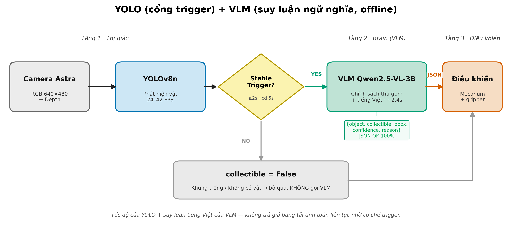
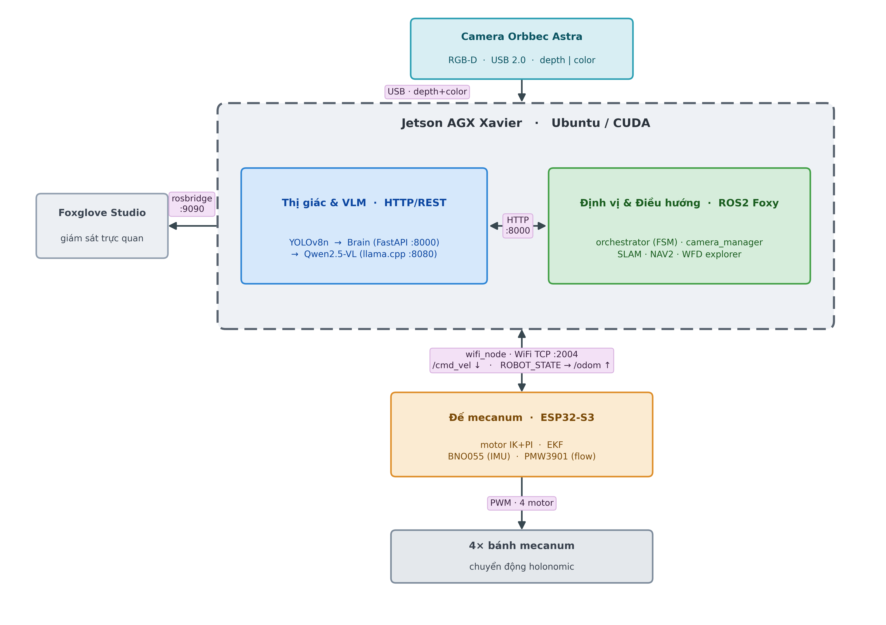

# Phát triển Robot di động đa hướng thu thập vật thể thông minh

Robot mecanum **tự hành thu gom rác tái chế**: điều hướng bằng **SLAM + NAV2**, phát hiện vật bằng **YOLOv8n** (thị giác nhanh) và ra quyết định "có thu gom không" bằng **Qwen2.5‑VL** (VLM — suy luận ngữ nghĩa). Triển khai trên **Jetson AGX Xavier** với camera độ sâu **Orbbec Astra**.

> Đây là repo mã nguồn Khoá luận tốt nghiệp (KLTN). Bản báo cáo đầy đủ đính kèm: [PHATTRIENROBOTDIDONGDAHUONGTHUTHAPVATTHETHONGMINH.pdf](PHATTRIENROBOTDIDONGDAHUONGTHUTHAPVATTHETHONGMINH.pdf).

---

## ⚠️ Lưu ý về gói mã nguồn nộp (đọc trước)

Để tối ưu dung lượng, repo này **KHÔNG đóng gói** các thành phần nặng/tự sinh sau đây. Chúng được tạo lại tự động khi build/chạy (xem hướng dẫn bên dưới):

| Thành phần bị loại | Lý do | Cách lấy lại |
|---|---|---|
| `layer2_brain/models/*.gguf` (~3 GB) | Trọng số model VLM, quá nặng | `python layer2_brain/setup_vlm.py` (tự tải) |
| `llama.cpp/` (~900 MB) | Engine chạy model, mã nguồn bên thứ ba | Clone từ https://github.com/ggml-org/llama.cpp hoặc để `setup_vlm.py` tự lo |
| Thư mục `build/`, `install/`, `log/`, `bin/`, `obj/` | Sản phẩm biên dịch (không đóng gói) | Sinh lại khi build (colcon / CMake / dotnet) |

---

## Tổng quan — hai hệ thống con

Repo gồm **2 stack** dùng chung model (YOLO + Qwen‑VL) và driver camera Astra:

| Stack | Thư mục | Vai trò | Nền tảng |
|---|---|---|---|
| **A. Pipeline VLM (3 lớp)** | `layer1_vision/` · `layer2_brain/` · `layer3_control/` | Nguyên mẫu "bộ não" + bộ đo hiệu năng: Camera → YOLO → VLM → quyết định → điều khiển tay gắp | Windows / Linux (dev), Jetson |
| **B. Robot tự hành (ROS2)** | `ros2_ws/` | Hệ thống thật chạy trên robot: SLAM + NAV2 + tự khám phá (WFD) + detect → đi tới vật | Jetson Xavier, ROS2 Foxy |
| Firmware & app | `Source_code/` | Firmware đế (ESP32), tay gắp (STM32), cầu CAN (Jetson), app điều khiển (.NET MAUI) | ESP‑IDF / STM32 / .NET |

- **Stack A** trả lời câu hỏi *"vật này có thu gom được không?"* — dùng để benchmark YOLO‑only vs VLM.
- **Stack B** là robot triển khai thật: dùng lại YOLO + driver Astra của Stack A, thêm SLAM/NAV2 để robot **tự đi tới** vật rồi gắp.

---

## A. Pipeline VLM 3 lớp



| Layer | Entry point | Vai trò | Port | Hướng dẫn |
|---|---|---|---|---|
| 1 | `layer1_vision/vision_node.py` | Camera → YOLO → trigger ổn định 2s → gửi ảnh | — (client) | [layer1_vision/README.md](layer1_vision/README.md) |
| 2 | `layer2_brain/brain_server.py` | Nhận ảnh → Qwen2.5‑VL → trả JSON quyết định | 8000 | [layer2_brain/README.md](layer2_brain/README.md) |
| — | `llama.cpp/` (tải riêng) | Engine chạy model GGUF | 8080 | — |
| 3 | `layer3_control/control_node.py` | **Lớp điều khiển** — nhận quyết định → kinematics → tay gắp; lớp kiến trúc đặt sẵn để ghép cánh tay thật (pose EKF + depth) | 8001 | [layer3_control/README.md](layer3_control/README.md) |

> **Vai trò kiến trúc của Layer 3.** Layer 3 là **lớp đặt sẵn cho việc ghép cánh tay gắp** — chủ đích thiết kế, không phải chỗ trống tạm. Hiện `control_node.py` + `kinematics.py` là bản tham chiếu: nhận quyết định thu gom từ Layer 2, chạy động học nghịch (inverse kinematics) rồi phát lệnh khớp/tay gắp qua Serial/PWM. Khi ghép cánh tay thật, lớp này sẽ **hợp nhất pose ước lượng từ EKF của đế** (`ROBOT_STATE`, xem Stack B) **với toạ độ 3D từ depth Astra** để tính điểm gắp trong hệ toạ độ robot. Nhờ tách riêng lớp này, phần thị giác + quyết định (Layer 1–2) **không phải thay đổi** khi lắp cơ cấu chấp hành mới — chỉ hoàn thiện Layer 3.

## B. Robot tự hành ROS2 (`ros2_ws/`)



7 package ROS2 — chi tiết & lệnh build/run: **[ros2_ws/README.md](ros2_ws/README.md)** · vận hành: [docs/DEMO_RUNBOOK.md](docs/DEMO_RUNBOOK.md).

> ⚠️ **Ràng buộc Astra USB 2.0**: camera **không stream depth + color đồng thời**. `camera_manager` giữ 1 camera và đổi mode theo topic `/camera_mode`. Mọi luồng demo xoay quanh ràng buộc này.

---

## Cấu trúc thư mục

```
PHATTRIENROBOTDIDONGDAHUONGTHUTHAPVATTHETHONGMINH/
├── layer1_vision/      # Stack A · Camera + YOLO + Astra depth + trigger        
├── layer2_brain/       # Stack A · FastAPI + Qwen2.5-VL qua llama.cpp           
├── layer3_control/     # Stack A · Flask + kinematics — lớp ghép cánh tay  
├── ros2_ws/            # Stack B · workspace ROS2 Foxy (7 package)              
├── Source_code/        # Firmware đế/tay + cầu CAN + app MAUI                   
│
├── scripts/            # Benchmark, eval accuracy, verify_setup, start VLM      
├── tools/              # Công cụ Astra (calib/noise/stream) + setup AP WiFi     
├── config/             # astra_intrinsics.json (nội tham số camera)
├── data/               # eval_dataset (ảnh + labels.json) 
├── docs/               # SPEC, PLAN_SLAM_NAV2, HANDOFF, DEMO_RUNBOOK, bảng+hình benchmark
├── Log/                # Frame + log runtime minh chứng (mẫu đại diện)
├── mecanum_robot.urdf.xacro   # URDF bản Gazebo (sim); bản thật ở ros2_ws/robot_description
├── requirements.txt
└── PHATTRIENROBOTDIDONGDAHUONGTHUTHAPVATTHETHONGMINH.pdf   # Báo cáo KLTN
```

---

## Hướng dẫn build & cài đặt

Mỗi thư mục lớn có README build riêng. Tóm tắt các bước chính:

### 1 — Python dependencies (Stack A)

```bash
pip install -r requirements.txt
```

### 2 — VLM: llama.cpp + model Qwen2.5‑VL (Stack A)

```bash
python layer2_brain/setup_vlm.py
```

Script tự động: kiểm tra prerequisites → tải/build `llama-server` (từ submodule `llama.cpp/` hoặc pre‑built binary) → tải model `Qwen2.5-VL-3B-Instruct-Q4_K_M.gguf` + `mmproj-*.gguf` (~2–3 GB) vào `layer2_brain/models/` → sinh lại `scripts/start_vlm_server.bat/.sh`.

Kiểm tra toàn bộ môi trường:

```bash
python scripts/verify_setup.py     # exit 0 = OK, có thể chạy offline
```

### 3 — ROS2 stack (Stack B, trên Jetson) — chi tiết: [ros2_ws/README.md](ros2_ws/README.md)

```bash
sudo apt install ros-foxy-slam-toolbox ros-foxy-navigation2 ros-foxy-nav2-bringup \
                 ros-foxy-depthimage-to-laserscan ros-foxy-rosbridge-server \
                 ros-foxy-teleop-twist-keyboard

cd ros2_ws
colcon build --symlink-install     # sinh ra build/ install/ log/ (KHÔNG đóng gói)
source install/setup.bash
```

Mạng WiFi AP cho đế: `sudo bash tools/setup_hostapd.sh`.

### 4 — Firmware & app (tuỳ chọn) — chi tiết: [Source_code/README.md](Source_code/README.md)

- **Đế ESP32‑S3** (`Source_code/Mecanum_robot/`): ESP‑IDF v5.x → `idf.py build` (sinh `build/`).
- **Tay gắp STM32F411** (`Source_code/STM32_Robot_arm/`): STM32CubeIDE hoặc `cmake --preset Debug && cmake --build build/Debug`.
- **Cầu CAN Jetson** (`Source_code/Jetson/Can_node.cpp`): `g++ Can_node.cpp -o can_node`.
- **App MAUI** (`Source_code/Multi_platform_app/`): .NET 9 SDK + workload MAUI → `dotnet build` (sinh `bin/`, `obj/`).

> Mọi thư mục build (`build/`, `install/`, `bin/`, `obj/`, `log/`) đã được `.gitignore` và **không** nằm trong gói nộp — build lại theo hướng dẫn trên.

---

## Chạy nhanh

### Stack A — Pipeline VLM (4 terminal)

```powershell
# T1 — VLM server
.\scripts\start_vlm_server.bat        # chờ: "llama server listening at http://127.0.0.1:8080"
# T2 — Brain API (Swagger UI: http://localhost:8000/docs)
python layer2_brain/brain_server.py
# T3 — Control Node
python layer3_control/control_node.py
# T4 — Vision Node (webcam) — hoặc test offline: --image test.jpg --mock-brain
python layer1_vision/vision_node.py
```

### Stack B — Robot tự hành (trên Jetson)

```bash
# Quét map lái tay (an toàn, validate SLAM):
ros2 launch robot_bringup bringup.launch.py nav:=false autonomous:=false
# Tự hành đầy đủ (WFD explorer + NAV2):
ros2 launch robot_bringup bringup.launch.py
# Demo thu gom: detect (YOLO) → đi tới vật:
ros2 launch robot_bringup collect.launch.py target_class:=bottle
```

Test không cần đế thật: thêm `odom:=fake`. Xem [ros2_ws/README.md](ros2_ws/README.md).

---

## Cấu hình

| File | Điều khiển |
|---|---|
| `layer2_brain/config.json` | Model VLM, `gpu_layers`, `context_size`, port, prompt policy thu gom (tiếng Việt) |
| `config/astra_intrinsics.json` | Nội tham số camera Astra (fx, fy, cx, cy) — dùng cho unproject 3D |
| `ros2_ws/src/robot_bringup/config/slam_toolbox.yaml` | Tham số SLAM (tune cho Astra: `max_laser_range 1.0`) |
| `ros2_ws/src/robot_bringup/config/nav2_params.yaml` | Tham số NAV2 (`robot_radius`, controller RPP) |
| `ros2_ws/src/robot_description/urdf/robot.urdf.xacro` | Kích thước robot + TF (đo lại khi ghép đế) |

---

## Minh chứng & tài liệu (Chương 4)

| Vị trí | Nội dung |
|---|---|
| `Log/` | Frame runtime (vision_node, astra_demo) + ảnh eval (montage/sample/glass_check) + log build/SDK |
| `data/eval_dataset/` | Bộ ảnh tự chụp + `labels.json` (đo accuracy collectibility) |
| `docs/bang_4_*.json`, `docs/figures/` | Số liệu & hình benchmark Chương 4 |
| [docs/SPEC.md](docs/SPEC.md) | Đặc tả tích hợp camera Astra 3D |
| [docs/PLAN_SLAM_NAV2.md](docs/PLAN_SLAM_NAV2.md) | Kế hoạch đầy đủ SLAM + NAV2 |
| [docs/DEMO_RUNBOOK.md](docs/DEMO_RUNBOOK.md) | Quy trình vận hành demo từng bước |
| [docs/HANDOFF.md](docs/HANDOFF.md) | Bàn giao stack ROS2 cho partner phần cứng |
