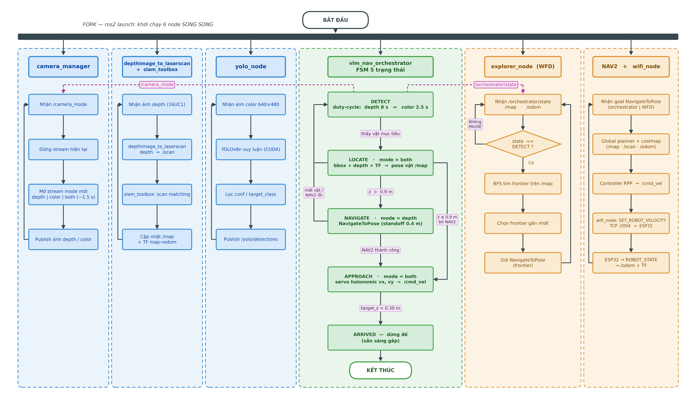

# Tóm tắt viết lại + Rà soát Chương 3 (kiến trúc phần mềm)

> Sản phẩm cho KLTN "Phát triển robot di động đa hướng thu thập vật thể thông minh".
> Gồm 4 phần: (1) Tóm tắt tiếng Việt, (2) Abstract tiếng Anh, (3) Rà soát logic bố cục
> mục kiến trúc phần mềm Chương 3 + hướng sắp xếp lại, (4) Hình lưu đồ song song ROS2
> kèm giải thích để chèn vào Chương 3.

---

## 1. TÓM TẮT KHÓA LUẬN (tiếng Việt — viết lại, tối đa ~1 trang)

Trong bối cảnh công nghiệp 5.0 và sự phát triển nhanh của trí tuệ nhân tạo, robot đang
được kỳ vọng chuyển từ kiểu lập trình cố định, cứng nhắc sang khả năng tự thích nghi với
môi trường chưa được cấu trúc hóa. Khóa luận "Phát triển robot di động đa hướng thu thập
vật thể thông minh" xây dựng nền tảng cho một robot vừa di chuyển linh hoạt, vừa hiểu được
chỉ dẫn bằng ngôn ngữ tự nhiên và nhận diện vật thể mục tiêu một cách thông minh, hướng tới
các ứng dụng trong kho vận, y tế và sản xuất linh hoạt. Nhóm tập trung hiện thực và kiểm
chứng hai trụ cột song song, bổ trợ cho nhau: nền tảng cơ điện tử điều khiển chuyển động cho
đế bốn bánh mecanum, và hệ thống thị giác ngữ nghĩa chạy trên thiết bị biên.

Ở trụ cột cơ điện tử, nhóm xây dựng mô hình toán học cho động cơ DC và thiết kế bộ điều
khiển PI kết hợp Feedforward, dùng phương pháp gán cực để hệ đáp ứng nhanh, không vọt lố và
triệt tiêu sai số tĩnh. Từ cấu tạo bánh mecanum, nhóm thiết lập mô hình động học thuận và
nghịch cho đế bốn bánh bố trí đối xứng, cho phép robot di chuyển đa hướng theo cả quỹ đạo
thẳng lẫn cong mà không cần đổi góc hướng. Bộ lọc Kalman mở rộng được dùng để ước lượng
trạng thái và định vị robot ổn định khi có nhiễu quá trình và nhiễu cảm biến. Phần thực
nghiệm của trụ cột này kiểm chứng năng lực di chuyển đa hướng của đế, gồm bám quỹ đạo cùng
với giữ ổn định vận tốc và hướng, làm nền cho việc gắn cánh tay máy ở giai đoạn sau.

Ở trụ cột thị giác ngữ nghĩa, hệ thống được tổ chức thành ba lớp giao tiếp qua REST API.
Lớp Vision phát hiện vật bằng YOLOv8n và một cơ chế kích hoạt ổn định; Lớp Brain suy luận
ngữ nghĩa bằng mô hình thị giác–ngôn ngữ Qwen2.5-VL-3B; Lớp Control chuyển lệnh điều khiển
tới robot. Cách tách lớp này cho phép kiểm thử từng lớp độc lập và triển khai phân tán. Để
hóa giải xung đột giữa luồng camera 30 khung mỗi giây và độ trễ vài giây của mô hình thị
giác–ngôn ngữ, nhóm đề xuất cơ chế StableTrigger dạng máy trạng thái hữu hạn, giúp loại bỏ
hoàn toàn kích hoạt sai trong thực nghiệm sơ bộ. Điểm nhấn kỹ thuật là việc nhúng thành công
Qwen2.5-VL-3B lên NVIDIA Jetson AGX Xavier trong giới hạn tài nguyên khắc nghiệt: mô hình
được lượng tử hóa về định dạng GGUF mức Q4_K_M và chạy trên engine llama.cpp với backend
CUDA cho ARM64. Nhóm tài liệu hóa đầy đủ quy trình biên dịch, danh sách lỗi và cách khắc
phục, chiến lược GPU offloading, cách phân bổ bộ nhớ thống nhất, prompt tiếng Việt cùng cơ
chế phân tích JSON ba cấp, và ba dịch vụ systemd tự phục hồi để hệ vận hành liên tục và hoàn
toàn ngoại tuyến, không phụ thuộc kết nối đám mây.

Toàn bộ hệ thống đã được tích hợp theo kiến trúc ba lớp Vision–Brain–Control và kiểm chứng
theo luồng đầu cuối: robot di chuyển trong không gian làm việc, phát hiện vật bằng YOLOv8n,
xác nhận ngữ nghĩa bằng VLM, rồi căn cứ tọa độ mục tiêu để điều hướng đế tiếp cận vật. Thực
nghiệm cho thấy YOLOv8n đạt khoảng 106 khung mỗi giây trên máy tính, vượt xa mục tiêu 15
khung; cơ chế phân tích JSON đạt tỉ lệ thành công tuyệt đối; và thiết kế lai giữa YOLO và VLM
có kích hoạt giữ được khả năng suy luận ngữ nghĩa mà không phải trả giá bằng tải tính toán
liên tục như phương án chỉ dùng VLM. Nhóm cũng thẳng thắn nêu các hạn chế còn tồn tại, gồm
độ trễ VLM còn ở mức vài giây, tập dữ liệu kiểm thử còn nhỏ, hệ mới xử lý một vật mỗi chu kỳ
và chưa tích hợp thao tác gắp bằng cánh tay máy, cùng các hướng phát triển tiếp theo như bổ
sung cánh tay với vòng điều khiển phản hồi thị giác, tích hợp camera 3D, tăng tốc VLM và hỗ
trợ đa vật thể.

---

## 2. ABSTRACT (tiếng Anh — tối đa ~1 trang)

In the context of Industry 5.0 and the rapid progress of artificial intelligence, robots are
increasingly expected to move away from fixed, rigid programming toward the ability to adapt
on their own to unstructured environments. This thesis, "Developing an omnidirectional mobile
robot for intelligent object gathering," builds the foundation for a robot that can move
flexibly, understand instructions given in natural language, and recognize target objects
intelligently, aiming at applications in logistics, healthcare, and flexible manufacturing.
The work focuses on implementing and validating two parallel and complementary pillars: a
mechatronics and motion-control platform for a four-wheel mecanum base, and a semantic vision
system running entirely on an edge device.

For the mechatronics pillar, the team derives a mathematical model of the DC motor and designs
a PI controller with a feedforward term, using pole placement so that the system responds
quickly, avoids overshoot, and eliminates steady-state error. Starting from the geometry of the
mecanum wheel, the team establishes the forward and inverse kinematics of a symmetric four-wheel
base, which lets the robot move omnidirectionally along both straight and curved paths without
changing its heading. An extended Kalman filter estimates the robot's state and keeps
localization stable under process and sensor noise. Experiments for this pillar verify the
base's omnidirectional motion, namely path tracking together with stable speed and heading,
laying the groundwork for adding a manipulator arm in a later stage.

For the semantic vision pillar, the system is organized into three layers that communicate over
a REST API. The Vision layer detects objects with YOLOv8n and a stable triggering mechanism;
the Brain layer performs semantic reasoning with the Qwen2.5-VL-3B vision–language model; and
the Control layer forwards motion commands to the robot. This separation allows each layer to be
tested independently and deployed in a distributed manner. To resolve the conflict between a
30-frame-per-second camera stream and the several-second latency of the vision–language model,
the team proposes StableTrigger, a finite-state mechanism that completely removes false
activations in preliminary experiments. The main technical highlight is the successful embedding
of Qwen2.5-VL-3B onto an NVIDIA Jetson AGX Xavier under severe resource limits: the model is
quantized to the GGUF format at the Q4_K_M level and runs on the llama.cpp engine with a CUDA
backend for ARM64. The team thoroughly documents the build process, the list of errors and
their fixes, the GPU offloading strategy, the unified-memory budget, the Vietnamese prompt with
a three-level JSON parsing scheme, and three self-healing systemd services that keep the system
running continuously and fully offline.

The complete system was integrated following the three-layer Vision–Brain–Control architecture
and validated end to end: the robot moves through the workspace, detects an object with
YOLOv8n, confirms its meaning with the VLM, and then uses the target coordinates to navigate the
base toward the object. Experiments show that YOLOv8n reaches about 106 frames per second on a
PC, far above the 15-frame target; the JSON parsing mechanism succeeds every time; and the
hybrid design preserves semantic reasoning without paying the constant computational cost of a
VLM-only approach. The thesis also states its remaining limitations openly, namely a VLM latency
still on the order of a few seconds, a small test set, one object handled per cycle, and no
arm-based grasping yet, together with future directions such as adding an arm with visual
servoing, integrating a 3D camera, accelerating the VLM, and supporting multiple objects.

---

## 3. RÀ SOÁT LOGIC BỐ CỤC MỤC KIẾN TRÚC PHẦN MỀM (Chương 3)

### 3.1. Bố cục hiện tại (3.4 → 3.8)

```
3.4 Thiết kế hệ thống phần mềm
    3.4.1 Tổng quan kiến trúc hệ thống        → giới thiệu HAI phân hệ
    3.4.2 Kiến trúc tổng thể ba lớp phần mềm  → giới thiệu BA lớp (Vision–Brain–Control)
    3.4.3 Lớp Vision                          → "đọc khung hình từ webcam"
    3.4.4 Lớp Brain                           → VLM qua llama.cpp
    3.4.5 Lựa chọn thiết kế cho Jetson Xavier → ngân sách bộ nhớ, lượng tử hóa
    3.4.6 Tích hợp ở cấp service              → systemd
3.5 Tích hợp camera chiều sâu Astra           → "ban đầu dùng webcam… thay bằng Astra"
3.6 Phân hệ định vị và điều hướng ROS2        → TF, /scan, SLAM+NAV2, TCP đế
3.7 Hiện thực hệ thống                        → môi trường, file/LOC từng lớp, 7 gói ROS2
3.8 Tích hợp end-to-end                       → nguyên lý điều phối + máy trạng thái (FSM)
```

### 3.2. Nhận định chung

Bố cục **đi đúng mạch lớn** "thiết kế → tích hợp cảm biến → phân hệ điều hướng → hiện thực →
tích hợp cuối", nên đọc vẫn theo dõi được. Tuy nhiên có **năm điểm gợn về logic** làm người
đọc lần đầu dễ khựng lại, và **hai chỗ nên đảo thứ tự**. Dưới đây liệt kê theo mức độ ưu tiên.

### 3.3. Các vấn đề cụ thể (xếp theo độ quan trọng)

**(1) Mâu thuẫn giữa khung "hai phân hệ" và khung "ba lớp" — quan trọng nhất.**
Mục 3.4.1 giới thiệu hệ là *hai phân hệ chạy song song* (Vision & VLM; Định vị & Điều hướng),
nhưng ngay 3.4.2 lại mô tả hệ là *ba lớp* Vision → Brain → Control giao tiếp qua REST. Hai mô
hình tư duy này không bao giờ được nối lại với nhau. Hệ quả: "Lớp 3 – Control" trong mô hình
REST là gì so với phân hệ điều hướng ROS2 ở 3.6? 3.4.2 nói Control nhận lệnh qua HTTP, nhưng
3.6 lại cho thấy toàn bộ điều khiển/điều hướng nằm trên ROS2 (NAV2, wifi_node, /cmd_vel) —
tức "Lớp 3 qua HTTP" mâu thuẫn với thực tế ROS2.
→ *Hướng xử lý:* chọn **một** khung xương chính. Đề xuất lấy "hai phân hệ" làm gốc, rồi nói
rõ: Phân hệ thị giác ngữ nghĩa = ba lớp Vision–Brain–Control; Phân hệ điều hướng = ngăn xếp
ROS2; **"Lớp 3 – Control" được hiện thực bằng chính phân hệ ROS2**, và ranh giới giữa hai bên
là node điều phối gọi Brain qua HTTP cổng 8000. Câu chốt ranh giới này hiện nằm mãi ở 3.6.1,
nên **kéo lên 3.4.1/3.4.2**.

**(2) Kể chuyện "webcam" trước rồi mới thay bằng Astra — gây hụt hẫng.**
3.4.3 mô tả Lớp Vision "đọc khung hình từ webcam 640×480", 3.7.2 dùng `cv2.VideoCapture(0)`;
đến 3.5.1 mới nói "thiết kế ban đầu dùng webcam… nay thay bằng Astra". Trong khi đó 3.2 đã
trình bày rất kỹ camera Astra *trước cả* 3.4.3. Vậy trình tự là: lý thuyết Astra (3.2) →
thiết kế theo webcam (3.4.3) → lại chuyển sang Astra (3.5). Người đọc học một thiết kế đã lỗi
thời rồi mới được đính chính.
→ *Hướng xử lý:* ở 3.4.3 mô tả đầu vào camera **qua Lớp trừu tượng camera** (Astra là driver
chính, webcam chỉ là một driver dự phòng), và chỉ giữ lại một câu ngắn ghi nhận "ban đầu dùng
webcam" như một ghi chú tiến hóa thiết kế, không để nó làm mô tả chính.

**(3) 3.4.5 (ngân sách bộ nhớ + lượng tử hóa) đặt hơi lạc altitude.**
Nội dung 3.4.5 gần như hoàn toàn là hệ quả của việc triển khai **Lớp Brain/VLM** (bộ nhớ
thống nhất, Q4_K_M, GPU offload), nhưng tiêu đề lại rất rộng "Lựa chọn thiết kế cho thiết bị
nhúng Jetson", và một phần trùng với 3.3 (phần cứng Jetson). Ngoài ra Bảng 3.2 ghi "16 GB"
trong khi 3.4.1 và cả 3.4.5 nói "32 GB" — **mâu thuẫn 16 GB / 32 GB** lặp lại ở nhiều nơi
(kể cả phần Tóm tắt).
→ *Hướng xử lý:* đưa 3.4.5 thành mục con **ngay sau 3.4.4 (Lớp Brain)** và đổi tên thành
"Triển khai VLM trên Jetson: ngân sách bộ nhớ và lượng tử hóa"; đồng thời **thống nhất lại con
số dung lượng RAM** trên toàn báo cáo.

**(4) Đảo thứ tự 3.7 và 3.8.**
3.8 (Tích hợp end-to-end + máy trạng thái điều phối) thực chất là **thiết kế** cấp cao của
cách cả hệ vận hành, gắn chặt với phân hệ ROS2 ở 3.6. Trong khi 3.7 (Hiện thực) là phần "code
ra sao": file, số dòng, 7 gói ROS2, logging. Đặt 3.7 *trước* 3.8 khiến mạch bị gãy: đang nói
chi tiết hiện thực thì quay lại nói nguyên lý điều phối tổng thể.
→ *Hướng xử lý:* **đưa "Tích hợp end-to-end + FSM" lên ngay sau 3.6** (vì cùng thuộc phân hệ
điều hướng và là chỗ hai phân hệ gặp nhau), rồi để **"Hiện thực & triển khai" làm mục chốt
cuối** của Chương 3.

**(5) Sai chéo tham chiếu (cross-reference) — nhỏ nhưng dễ bị bắt lỗi khi bảo vệ.**
- 3.6.4 ghi "khép kín cây tọa độ TF (mục 3.4.3)" nhưng cây TF nằm ở **3.6.2**.
- 3.8.1 ghi "(mục 3.3.4)" cho ràng buộc USB 2.0 depth/color — **mục 3.3.4 không tồn tại**;
  nội dung thật nằm ở 4.9.2 (chương sau). Ràng buộc phần cứng này định hình cả FSM nên
  **cần được nêu ngay trong Chương 3**, không để đến Chương 4.
- 3.2.2 ghi "Công thức (2.31)" và "ở Chương 3" trong khi công thức là **(3.2)** và đang ở
  chính Chương 3; 3.5.3 ghi "phương trình 2.30" — cũng nên là **(3.2)**.
→ *Hướng xử lý:* rà lại toàn bộ tham chiếu chéo sau khi chốt bố cục.

**(6) Astra bị cắt làm đôi (3.2 và 3.5) — chấp nhận được nhưng nên nối.**
3.2 (lý thuyết/cảm biến, thuộc cụm phần cứng) và 3.5 (tích hợp phần mềm) cách nhau bởi cả 3.3
và 3.4. Cách chia "phần cứng rồi phần mềm" là hợp lý, nhưng nên thêm **tham chiếu chéo rõ**
giữa hai mục để người đọc nối được mạch.

**(7) 3.7 lặp nội dung 3.4.**
3.7.2 tả lại Lớp 1, 3.7.3 tả lại Brain — vốn đã có ở 3.4.3/3.4.4. Tách "thiết kế" và "hiện
thực" là hợp lệ, nhưng nên để 3.7 **chỉ nói phần hiện thực thuần** (tên file, số dòng, thư
viện, cách deploy), tránh giải thích lại thiết kế.

### 3.4. Hướng sắp xếp lại đề xuất (giữ nguyên đánh số cấp 1 khi có thể)

```
3.4 Thiết kế hệ thống phần mềm
    3.4.1 Tổng quan: hai phân hệ và ranh giới giao tiếp
          → chốt khung xương; nêu rõ HTTP:8000 là ranh giới; orchestrator là cầu nối
            (Hình 3.16)
    3.4.2 Phân hệ thị giác ngữ nghĩa — kiến trúc ba lớp
          a) Ba lớp REST Vision–Brain–Control (Hình 3.17)
          b) Lớp Vision: đầu vào qua Lớp trừu tượng camera, YOLOv8n, StableTrigger
          c) Lớp Brain: VLM qua llama.cpp, prompt tiếng Việt, JSON fallback, mock
          d) Triển khai VLM trên Jetson: ngân sách bộ nhớ + Q4_K_M + GPU offload  (từ 3.4.5)
          e) Tích hợp cấp service systemd                                        (từ 3.4.6)
3.5 Tích hợp camera chiều sâu Astra                                             (giữ; nối 3.2)
3.6 Phân hệ định vị và điều hướng ROS2                                          (giữ)
3.7 Tích hợp end-to-end và điều phối                                            (từ 3.8, DỜI LÊN)
    3.7.1 Nguyên lý điều phối — nêu ràng buộc USB 2.0 phân pha camera Ở ĐÂY
    3.7.2 Lưu đồ khởi chạy song song 6 node ROS2   ← CHÈN HÌNH MỚI (xem Phần 4)
    3.7.3 Máy trạng thái node điều phối (Hình FSM)
3.8 Hiện thực và triển khai                                                     (từ 3.7, DỜI XUỐNG)
    môi trường, file/LOC từng lớp, 7 gói ROS2, logging & giám sát Foxglove
```

**Nếu muốn sửa tối thiểu** (không đảo số mục): chỉ cần làm (1), (2), (5) — tức chốt khung
"hai phân hệ ↔ ba lớp" ở 3.4.1, sửa mô tả camera ở 3.4.3, và vá các tham chiếu chéo. Ba việc
này gỡ được phần lớn chỗ khựng mà gần như không phải xáo trộn bố cục.

---

## 4. HÌNH LƯU ĐỒ SONG SONG ROS2 — CHÈN VÀO CHƯƠNG 3

**Vị trí đề xuất:** đầu mục *Tích hợp end-to-end* (3.8.1 hiện tại, hoặc 3.7.1 nếu đã dời theo
Phần 3.4). Hình này là "bức tranh toàn cảnh runtime" nên đặt **ngay trước** hình máy trạng
thái (Hình 3.27) là hợp lý nhất: hình mới cho thấy *toàn bộ 6 node chạy song song*, còn Hình
3.27 phóng to riêng phần FSM bên trong node điều phối. Khi chèn, đánh số hình mới là **Hình
3.27** và dời hình máy trạng thái hiện tại thành **Hình 3.28**.



**Chú thích hình:** *Hình 3.27: Lưu đồ khởi chạy song song sáu node ROS2 và luồng điều phối
của hệ thống.*

**Đoạn giải thích (viết theo giọng sinh viên năm cuối Kỹ thuật Máy tính, chuyên ngành Hệ
thống nhúng):**

Khi chạy lệnh `ros2 launch`, cả hệ không khởi động tuần tự mà "fork" ra sáu node chạy song
song cùng lúc, mỗi node lo một việc riêng và trao đổi dữ liệu với nhau qua topic. Nhìn từ
trái sang phải: `camera_manager` là node giữ camera Astra, nó nghe topic `/camera_mode` để
biết lúc nào cần mở luồng depth, color hay cả hai; vì Astra cắm qua USB 2.0 nên không thể bật
cả depth lẫn color cùng lúc, mỗi lần đổi mode mất khoảng 1,5 giây. Node
`depthimage_to_laserscan + slam_toolbox` biến ảnh chiều sâu thành một lát quét `/scan` giống
LiDAR rồi dựng bản đồ `/map` và phát cây tọa độ `map→odom`. Còn `yolo_node` lấy ảnh màu, chạy
YOLOv8n trên CUDA để tìm vật và bắn kết quả ra `/yolo/detections`.

Trái tim của hệ là node `vlm_nav_orchestrator`, một máy trạng thái năm bước: DETECT tìm vật,
LOCATE tính tọa độ 3D của vật trên bản đồ, NAVIGATE nhờ NAV2 chạy tới gần, APPROACH bám sát
mục tiêu bằng vận tốc holonomic, rồi ARRIVED thì dừng đế chờ gắp. Nó cầm trịch cả đám còn lại
bằng hai topic: `/camera_mode` để ra lệnh cho camera đổi luồng theo từng pha, và
`/orchestrator/state` để báo cho `explorer_node` biết mình đang ở trạng thái nào.
`explorer_node` chạy thuật toán WFD để tự tìm vùng chưa khám phá, nhưng nó "nhường đường",
chỉ đi khám phá khi orchestrator đang rảnh ở pha DETECT, còn không thì PAUSE. Cuối cùng,
`NAV2 + wifi_node` nhận goal, lập đường đi, sinh `/cmd_vel`, rồi `wifi_node` gói lại gửi
xuống ESP32 qua TCP để quay bốn bánh mecanum; chiều ngược lại, ESP32 gửi trạng thái ước lượng
từ EKF lên và được publish thành `/odom`.

Điểm hay của thiết kế này là mọi thứ chạy đồng thời và phối hợp lỏng qua topic, nên một node
bị lỗi hay chậm cũng không kéo sập cả hệ. Ngoài ra, việc để orchestrator tự quản mode camera
theo từng pha giúp né được nút cổ chai băng thông USB 2.0 mà vẫn giữ được cả SLAM lẫn nhận
diện — nói cách khác, robot dừng lại lúc quan sát là hành vi cố ý theo ràng buộc phần cứng,
chứ không phải lỗi.
